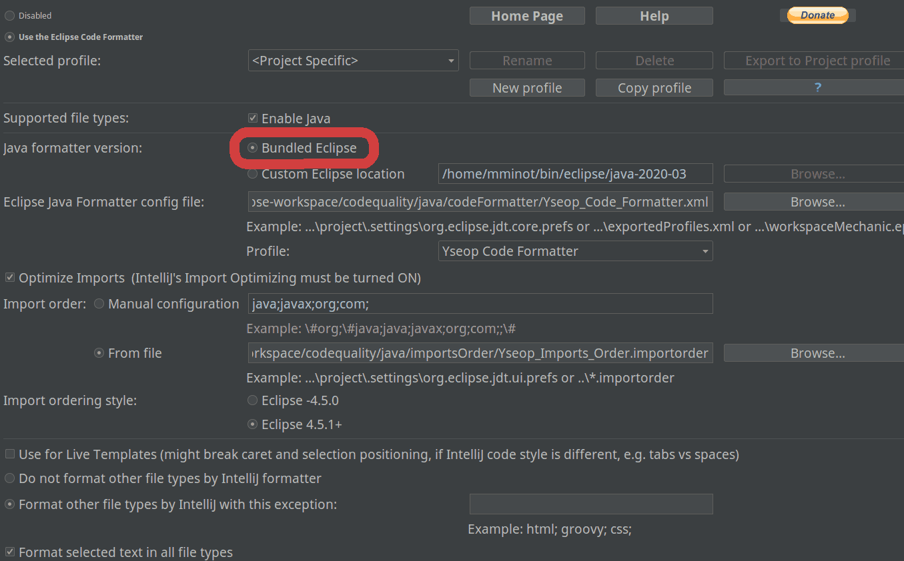

= Yseop code style documentation

:experimental:
:toc2:
:sectnums:
:revnumber: 1.0
:icons: font
:source-highlighter: coderay
:sectanchors:
:imagesdir: readme-img

This document's goal is to show how to enforce the Yseop code Style (based on http://google.github.io/styleguide/javaguide.html[Google's guidelines]).

== Introduction

Developers at Yseop can choose their preferred IDE among: 

* Eclipse (most common use), 
* IntelliJ (most recently used), 
* and maybe others.

In order to avoid code changes (and merge conflicts or whatever) when developers work with different IDEs on the same project, we have to find a common code Formatter configuration.

As most of the codebase has been formatted with Eclipse code formatter, we will keep Eclipse code formatter as the reference and try to configure the other IDEs to match Eclipse configuration.

== Prerequisite

To be able to use the Yseop check style and formatter, you must first clone this repository (`git@github.com:yseop/codequality.git`) to have access to the files.

This repository embed a few test files in the `java/template/` directory.
Once your IDE settings are done, try to reformat these template files and check with `git diff` that they are unchanged.
See your IDE’s dedicated section to learn how to reformat a set of files.

== Eclipse

=== Eclipse CheckStyle Plugin

First, you need to install the http://checkstyle.org/eclipse-cs/#!/[CheckStyle Plugin] (drag and drop the btn:[install] button into your Eclipse workspace window, to trigger the installation).

* Once this is done, go to menu:Window[Preferences > CheckStyle].

You'll see a list of two already existing configurations (Google and Sun):

* Click on btn:[New] and in the new window select btn:[External Configuration File].
* Put the name [red]`Yseop Code Checks` (the name is important) in the `Name` box, then click on btn:[Browse], and select [red]`{PATH_TO_CODEQUALITY_REPOSITORY}/java/codeChecks/Yseop_Code_Checks.xml`.
* Then click on btn:[Set as default], and finally, btn:[Apply and Close].

Eclipse will prompt you about rebuilding the projects, select btn:[Yes].

If you already are on a branch from an Yseop project, the checkstyle environment configuration will be automatic.

You should now see the code style 'errors' highlighted in your editor.

=== Eclipse Formatter

To try and fix these 'errors', you need to add a code formatter to Eclipse:

* Go to menu:Window[Preferences > Java > Code Style > Formatter].
* Click on btn:[Import], and select [red]`{PATH_TO_CODEQUALITY_REPOSITORY}/java/codeFormatter/Yseop_Code_Formatter.xml`.
* Apply and Close.

To make sure the formatter will be used by each of your project:

* Right click on a project's root folder, select btn:[Properties].
* Go to menu:Java Code Style[Formatter], and make sure the btn:[Enable project specific settings] box is *_not_* checked.

Now to format your code, you can use the kbd:[Ctrl + Shift + F] shortcut in any Java file. It also works if you select a specific line.

You can also format a folder with a right click on this folder and menu:Source[Reformat code] and menu:Source[Optimize imports].

=== Save Actions

To be sure not to forget to format your code, you can set “save actions”, a set of actions that will be triggered each time you save a modification in your code.

* Go to menu:Window[Preferences > Java > Editor > Save Actions].
* Tick the btn:[Perform the selected action on save] box.
* Then tick the btn:[Format source code] box, and make sure the btn:[Format all lines] option is selected.
* Also tick the btn:[Organize imports] box. This will be discussed in the following chapter.
* Tick the btn:[Additional Actions] box.
* Click on btn:[Configure…]. Within the “Code Style” tab, check the box btn:[Use blocks in if/while/for/do statements] (leave “always”).
* Click btn:[Ok], btn:[Apply and Close].

To make sure the save actions will be the same for each of your projects:

* Right click on a project's root folder, select btn:[Properties].
* Go to menu:Java Editors[Save Actions], and make sure the btn:[Enable project specific settings] box is *_not_* checked.

=== Imports

Imports organization is also important for a standardized code style. The rule is to sort imports alphabetically.

* Go to menu:Window[Preferences > Java > Code Style > Organize Imports].
* Click on btn:[Import…] and select the file `{PATH_TO_CODEQUALITY_REPOSITORY}/java/importsOrder/Yseop_Imports_Order.importorder`.
* Make sure the btn:[Number of imports needed for .\*] and btn:[Number of static imports needed for .*] are set to{nbsp}99.
* Apply and close.

To make sure the imports organization will be the same for each of your project:

* Right click on a project's root folder, select btn:[Properties].
* Go to menu:Java Code Style[Organize Imports], and make sure the btn:[Enable project specific settings] box is *_not_* checked.

You can now reorganize your imports by using kbd:[Ctrl + Shift + O], or by just saving a modification, thanks to the save actions.

== IntelliJ

[NOTE]
====
In IntelliJ, a plugin configuration is for the current project only.
Therefore, by default, you'll need to configure each project you're working on.
Fortunately, you can save time with those two steps:

* [x] Create a dedicated profile (with a name like “Yseop”) in the formatter’s settings instead of keeping it to “`<Project Specific>`”.

* [x] Set formatter settings and save actions in menu:File[New Projects Setup > Settings for new projects…] so that each newly imported project will immediately use the right settings.
====

=== Code formatter

To match Eclipse code formatter configuration, we will use the IntelliJ plugin link:https://plugins.jetbrains.com/plugin/6546-eclipse-code-formatter[Eclipse code formatter]

.Notes
. The standard IntelliJ code formatter has options that won't be available with this plugin, but the aim (see link:#_introduction[Introduction]) is to keep a common configuration between diffrent IDEs.

. Tries to configure the IntelliJ standard code formatter to match the Eclipse code formatter settings weren't successful: there were always differences between both formatters (especially in Javadoc, empty blocks and white lines).

==== Installation

Install the Eclipse code Formatter plugin from IntelliJ settings:

- link:http://www.jetbrains.com/idea/webhelp/installing-updating-and-uninstalling-repository-plugins.html[Tutorial: Installing, Updating and Uninstalling Repository Plugins]

- link:http://plugins.jetbrains.com/plugin/?idea&id=6546[Plugin repository page]

==== Configuration

- Go to menu:File[Settings > Other settings > (Adapter for) Eclipse code formatter],

- Check btn:[Use Eclipse code formatter] (it's not automatically enabled),

- Verify that btn:[Enable Java] is checked,

- If the btn:[Bundled Eclipse] option is available in your IntelliJ and plugin version (see <<settings-pic, screenshot>>), select it.footnote:[
    It seems that it is less prone to missing JAR files required by the plugin, but was removed at some point.
] *Otherwise:*
** Choose btn:[Custom Eclipse location (4.5+ / Mars+)] and browse to your Eclipse installation folder (Warning: Misconfiguration problems have been detected with both options Eclipse 4.4 and Eclipse 4.9),

- Set the path to Eclipse formatter config file `{PATH_TO_CODEQUALITY_REPOSITORY}/java/codeFormatter/Yseop_Code_Formatter.xml`,

- The plugin should automatically detect the profile `Yseop code Formatter`,

- Check btn:[Optimize imports],

- Check menu:Import order[From file] and select `{PATH_TO_CODEQUALITY_REPOSITORY}/java/importsOrder/Yseop_Imports_Order.importorder`,

[[settings-pic]]

- Add filetype exclusions, otherwise the IDE may wreck, for example, the alignment of environment variables in the Jenkinsfiles and perform lots of similar unwanted changes in property files:

image::type-exclusions.png[Filetype exclusions]

- Click btn:[OK].

- Also make sure the btn:[Class count to use import with '+++*+++'] and btn:[Names count to use static import with '+++*+++'] are set to{nbsp}99:
+
image::imports-intellij.png[Settings window screenshot for imports]

Now to format your code, you can use the menu:Code[Reformat code] menu in any Java file. It also works if you select a specific line.

You can also format a folder with a right click on this folder and btn:[Reformat Code] and btn:[Optimize Imports].

=== Save actions

To be sure not to forget to format your code, you can set “save actions”, a set of actions that will be triggered each time you save a modification in your code.

* Install the `Save Actions` plugin.

* Go to menu:File[Settings > Other settings > Save Actions].

* Tick the 3 options in the “General” panel:
** [x] btn:[Activate save actions on save],
** [x] btn:[Activite save actions on shortcut],
** [x] btn:[No action if compile errors].

* Then tick the btn:[Optimize imports] box, and the btn:[Reformat file] box.

* Then tick the boxes:
** [x] btn:[Add missing @Override annotations],
** [x] btn:[Add blocks to if/while/for statements],
** [x] btn:[Remove explicit generic type for diamond]
** [x] and btn:[Remove unnecessary semicolon] boxes.

* Click btn:[OK].
